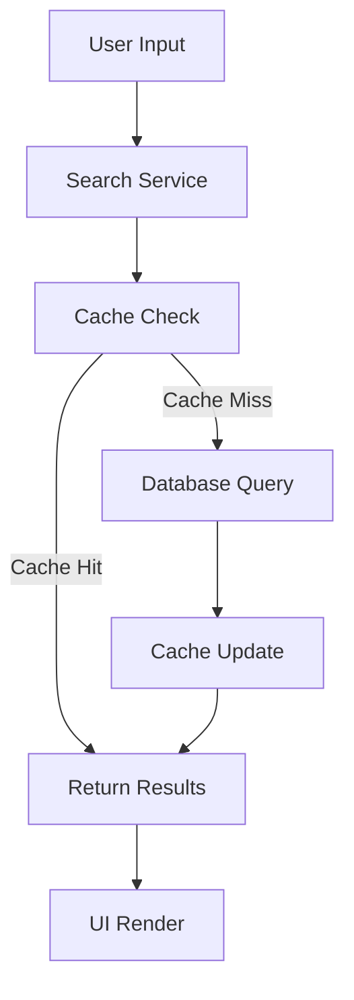

# Streamlit Application Component Technical Specifications

## Overview
The Streamlit application serves as the user interface for accessing and searching through collected news articles. It provides a modern, responsive interface with advanced search and filtering capabilities.

## Technical Stack
- Python 3.9+
- Streamlit 1.24+
- PostgreSQL for data storage
- Redis for caching
- Elasticsearch for full-text search
- Docker for containerization

## Architecture

### 1. Application Structure
```
app/
├── main.py
├── pages/
│   ├── home.py
│   ├── search.py
│   ├── analytics.py
│   └── settings.py
├── components/
│   ├── search_bar.py
│   ├── article_card.py
│   ├── filters.py
│   └── charts.py
├── services/
│   ├── database.py
│   ├── search.py
│   └── cache.py
└── utils/
    ├── date_utils.py
    └── text_utils.py
```

### 2. Core Components

#### Main Application
```python
# main.py
import streamlit as st
from services.database import DatabaseService
from services.search import SearchService
from components.search_bar import SearchBar
from components.filters import Filters

class NewsApp:
    def __init__(self):
        self.db = DatabaseService()
        self.search = SearchService()
        self.setup_session_state()
    
    def setup_session_state(self):
        if 'search_query' not in st.session_state:
            st.session_state.search_query = ""
        if 'filters' not in st.session_state:
            st.session_state.filters = {}
```

#### Search Component
```python
# components/search_bar.py
class SearchBar:
    def __init__(self):
        self.search_service = SearchService()
    
    def render(self):
        query = st.text_input(
            "Search Articles",
            value=st.session_state.search_query,
            placeholder="Enter keywords..."
        )
        return query
```

#### Article Display
```python
# components/article_card.py
class ArticleCard:
    def render(self, article):
        with st.container():
            st.markdown(f"### {article.title}")
            st.markdown(article.summary)
            st.markdown(f"**Source:** {article.source}")
            st.markdown(f"**Date:** {article.published_date}")
```

### 3. Data Flow



## Features

### 1. Search Implementation
```python
# services/search.py
class SearchService:
    def search(self, query: str, filters: dict) -> List[Article]:
        # Check cache
        cache_key = self._generate_cache_key(query, filters)
        if cached_results := self.cache.get(cache_key):
            return cached_results
            
        # Perform search
        results = self.elasticsearch.search(
            index="articles",
            body={
                "query": {
                    "bool": {
                        "must": [
                            {"match": {"content": query}},
                            self._build_filters(filters)
                        ]
                    }
                }
            }
        )
        
        # Cache results
        self.cache.set(cache_key, results)
        return results
```

### 2. Filtering System
```python
# components/filters.py
class Filters:
    def render(self):
        col1, col2 = st.columns(2)
        
        with col1:
            date_range = st.date_input(
                "Date Range",
                value=(datetime.now() - timedelta(days=30), datetime.now())
            )
            
        with col2:
            categories = st.multiselect(
                "Categories",
                options=["Wages", "Regulations", "Market Trends"]
            )
```

### 3. Caching Strategy
```python
# services/cache.py
class CacheService:
    def __init__(self):
        self.redis = Redis()
        self.ttl = 3600  # 1 hour
        
    def get(self, key: str) -> Optional[Any]:
        return self.redis.get(key)
        
    def set(self, key: str, value: Any):
        self.redis.setex(key, self.ttl, value)
```

## Database Schema

### Search Index
```json
{
  "mappings": {
    "properties": {
      "title": { "type": "text", "analyzer": "english" },
      "content": { "type": "text", "analyzer": "english" },
      "summary": { "type": "text", "analyzer": "english" },
      "published_date": { "type": "date" },
      "source": { "type": "keyword" },
      "categories": { "type": "keyword" },
      "metadata": { "type": "object" }
    }
  }
}
```

## Performance Optimization

### 1. Caching Strategy
- Redis for search results
- In-memory caching for frequent queries
- Cache invalidation on updates

### 2. Query Optimization
- Index optimization
- Query result limiting
- Pagination implementation

### 3. UI Performance
- Lazy loading
- Virtual scrolling
- Component memoization

## Security

### 1. Authentication
```python
# services/auth.py
class AuthService:
    def authenticate(self, username: str, password: str) -> bool:
        # Implement authentication logic
        pass
        
    def get_user_permissions(self, user_id: str) -> List[str]:
        # Get user permissions
        pass
```

### 2. Authorization
- Role-based access control
- Feature-level permissions
- API key management

## Testing

### 1. Unit Tests
```python
# tests/test_search.py
def test_search_service():
    service = SearchService()
    results = service.search("wage increase", {})
    assert len(results) > 0
```

### 2. Integration Tests
- End-to-end search flow
- Filter functionality
- Cache behavior

### 3. Performance Tests
- Load testing
- Response time benchmarks
- Cache hit ratio

## Deployment

### Docker Configuration
```dockerfile
FROM python:3.9-slim

WORKDIR /app

COPY requirements.txt .
RUN pip install -r requirements.txt

COPY . .

EXPOSE 8501

CMD ["streamlit", "run", "main.py"]
```

### Environment Variables
```env
DATABASE_URL=postgresql://user:pass@db:5432/news
REDIS_URL=redis://redis:6379
ELASTICSEARCH_URL=http://elasticsearch:9200
```

## Monitoring

### 1. Application Metrics
- Response times
- Error rates
- User sessions
- Search patterns

### 2. System Metrics
- CPU usage
- Memory consumption
- Network I/O
- Cache performance

## Maintenance

### Daily Tasks
- Monitor error logs
- Check system health
- Verify cache performance

### Weekly Tasks
- Update dependencies
- Optimize search indices
- Clean old cache entries

### Monthly Tasks
- Performance review
- Security updates
- Capacity planning 